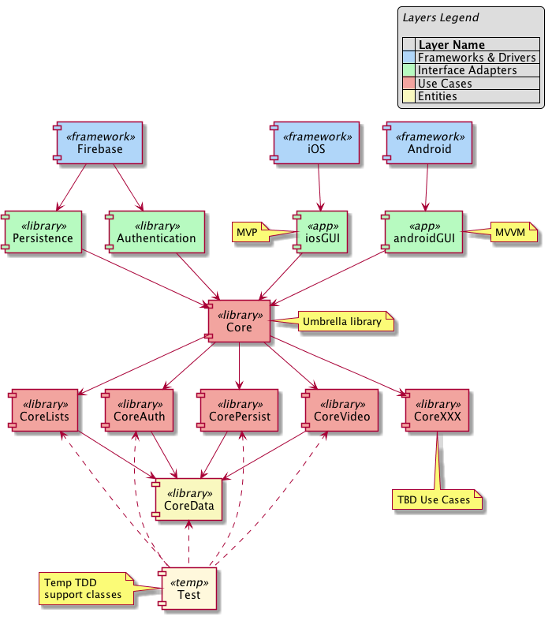

# Argus Application Structure

The following diagram represents the [Clean Architecture](https://8thlight.com/blog/uncle-bob/2012/08/13/the-clean-architecture.html) inspired application structure for *Argus*.

The outermost layer consists of the GUI frameworks (Android and iOS) and Firebase which serves as a authentication and persistence framework.

Moving inwards are the interface adapters which map the frameworks to the *Argus* core application modules, the next layer.

At the center is the Core Data module, primarily consisting of Video and VideoList objects.

The `<<app>>` modules provide the GUI code for each platform in as minimal a fashion as possible by invoking code in the core `<<library>>` modules to provide the main application features and functionality.

Each `<<library>>` modules for iOS are provided by Swift (Cocoa Touch) Frameworks (not to be confused with the iOS and Firebase framewoks) under the auspices of [Carthage](https://github.com/Carthage/Carthage#carthage--).

For Android, the <<library>> modules are Kotlin libraries provided by JitPack.

In a very strong sense, the main (GUI) modules "plug in" to the Core. The Core can also be considered the Domain layer in the Clean Architecture  sense.

The _Core_ module acts as an umbrella to wrap the modules providing the core application functions. Each wrapped core module implements the Use Cases or provides the core data.
